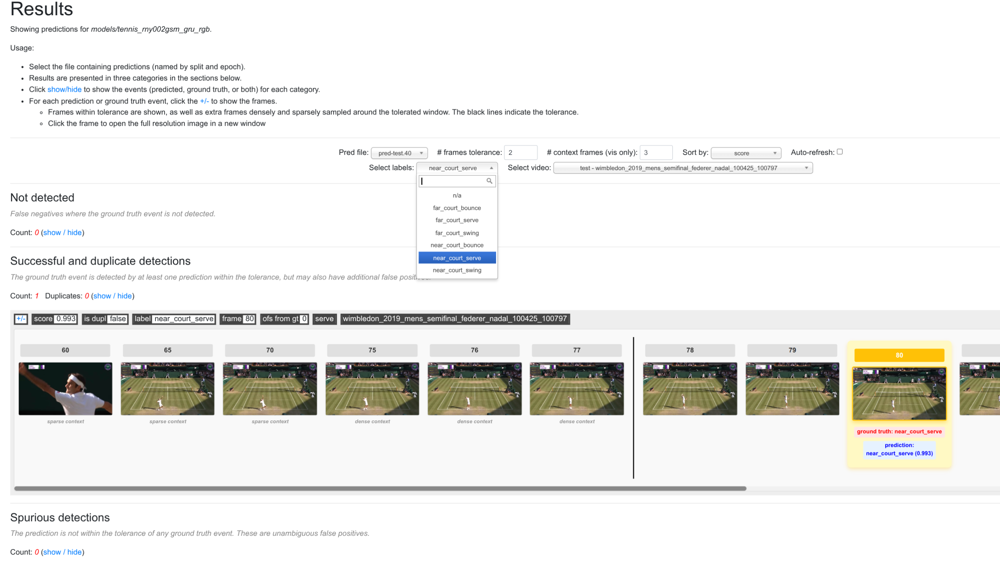
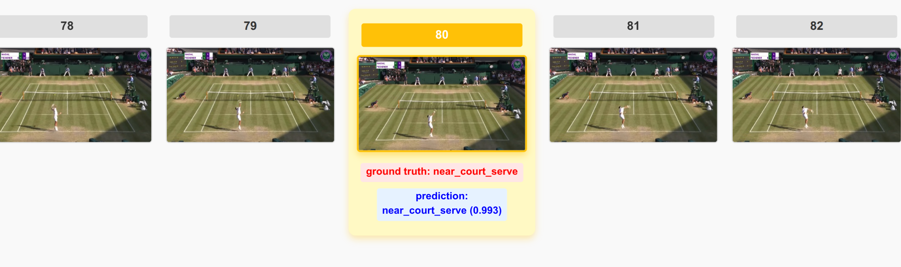
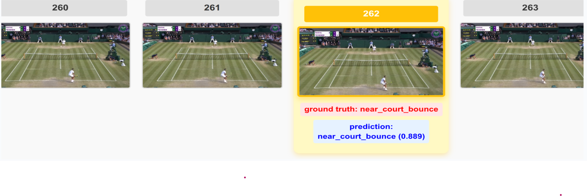
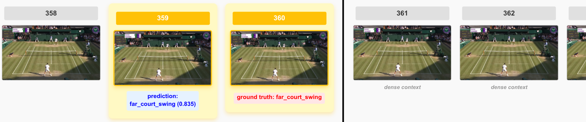

# Tennis Event Detection using SPOT (ECCV 2022)

Evaluation and analysis of a pre-trained SPOT model for fine-grained temporal event detection in professional tennis videos.

---

## Team Members

**Students:**
- Aicha WAAZIZ
- Chayma ALABDI

**Supervisor:**
- Prof. Mohtarame

**Institution:** Université Ibn Tofail, Kénitra, Morocco  
**Program:** Master in Artificial Intelligence & Connected Objects  
**Date:** January 2026

---

## Project Overview

This project evaluates a pre-trained SPOT (Spotting Temporally Precise Actions) model for detecting fine-grained temporal events in professional tennis videos. SPOT is a state-of-the-art temporal action spotting framework published at ECCV 2022.

**Model used:** `tennis_rny002gsm_gru_rgb` (pre-trained checkpoint 40)

### Events Detected

The model detects 6 tennis event types:
- Serve (near court / far court)
- Swing (near court / far court)
- Bounce (near court / far court)

---

## Objectives

1. Evaluate pre-trained SPOT model performance on tennis videos
2. Analyze temporal precision for fine-grained sports events
3. Study the impact of temporal tolerance on detection accuracy
4. Visualize predictions and compare with ground truth
5. Identify model strengths and limitations

---

## Our Contribution

### What We Did

**1. Environment Setup**
- Installed SPOT framework and dependencies
- Configured PyTorch with CUDA support(use CPU if GPU not available)

**2. Data Preparation**
- Download the tennis match video whose annotation already exists in the data/tennis
/test.json file.
In the JSON files, each video is separated into clips containing a certain number of frames.
In our case, we are only interested in the data/tennis/test.json file, where we chose to test on a single video (wimbledon_2019_mens_semifinal_federer_nadal), which contains 146 clips representing approximately 42 minutes of tennis video in total, with clips averaging around 14 seconds.
This is a small portion of the complete 3-hour match, containing only the annotated action segments (points of play).
- Extracted approximately 15,000 frames at 25 FPS using frames_as_jpg.py
- Organized dataset according to SPOT structure requirements

**3. Model Selection**
- Selected `tennis_rny002gsm_gru_rgb` model
- Justification: Good balance between performance and computational efficiency
- GRU-based temporal modeling suitable for sequential event detection
- RGB backbone appropriate for tennis court video analysis

**4. Inference & Evaluation**
- Performed end-to-end inference on test set
- Computed Average Precision (AP) at 4 temporal tolerances (0, 1, 2, 4 frames)
- Evaluated with and without Non-Maximum Suppression (NMS)
- Calculated mean Average Precision (mAP) across all event classes

**5. Analysis**
- Per-event performance breakdown
- Identified model strengths and limitations
- Analyzed impact of temporal tolerance and camera distance
- Generated prediction visualizations

**6. Documentation**
- Complete reproducible workflow
- Detailed results with interpretation

---

## Results

### Overall Performance

| Metric                       | Score      | Interpretation                                                     |
| ---------------------------- | ---------- | ------------------------------------------------------------------ |
| Average mAP (all tolerances) | **81.20%** | Strong overall detection                                           |
| mAP @ tol=0 (exact frame)    | 35.74%     | Very strict – requires exact frame match, difficult to achieve     |
| mAP @ tol=1 (±40ms)          | **93.86%** | Excellent temporal precision – model detects events almost exactly |
| mAP @ tol=2 (±80ms)          | **97.50%** | High reliability – small frame deviations allowed                  |
| mAP @ tol=4 (±160ms)         | 97.70%     | Nearly perfect – tolerant to temporal shift                        |

**Key Finding:**
The model achieves **93.86% mAP at ±1 frame (~40ms tolerance)**.

* This shows the model is **very precise in time**, detecting events almost exactly at the right frame.
* Scores increase with higher tolerances (tol=2, tol=4) because we allow **small temporal deviations**, but tol=1 is the most representative of true **temporal precision**.
* Tol=0 is extremely strict and gives a lower score, but it helps highlight the **challenge of exact temporal detection**.

---

### Detailed Results by Event Type

#### Without Non-Maximum Suppression (NMS)

| Event | AP @ tol=0 | AP @ tol=1 | AP @ tol=2 | AP @ tol=4 |
|-------|-----------|-----------|-----------|-----------|
| near_court_serve | 61.57% | **99.25%** | 99.38% | 99.38% |
| far_court_serve | 20.76% | 96.74% | 99.57% | 99.57% |
| near_court_swing | 36.25% | 96.70% | 97.85% | 98.02% |
| far_court_bounce | 34.29% | 92.55% | 96.45% | 96.57% |
| near_court_bounce | 23.10% | 89.72% | 97.66% | 98.35% |
| far_court_swing | 38.47% | 88.23% | 94.08% | 94.32% |
| **mAP** | **35.74%** | **93.86%** | **97.50%** | **97.70%** |

**Average mAP across all tolerances: 81.20%**

#### With Non-Maximum Suppression (NMS)

| Event | AP @ tol=0 | AP @ tol=1 | AP @ tol=2 | AP @ tol=4 |
|-------|-----------|-----------|-----------|-----------|
| near_court_serve | 50.90% | 97.11% | **100.00%** | **100.00%** |
| far_court_serve | 15.52% | 96.10% | 99.83% | 99.83% |
| near_court_swing | 24.51% | 95.71% | 98.42% | 99.47% |
| far_court_bounce | 24.40% | 89.53% | 97.63% | 98.40% |
| near_court_bounce | 16.44% | 85.12% | 97.51% | 99.44% |
| far_court_swing | 21.90% | 86.07% | 97.51% | 99.20% |
| **mAP** | 25.61% | 91.61% | 98.48% | 99.39% |

**Average mAP across all tolerances: 78.77%**


*Non-Maximum Suppression (NMS) slightly lowers performance when very strict temporal precision is required, but it helps reduce duplicate detections and produces cleaner, more reliable predictions for real-world use.*

---

## Visual Results

### Visualization Interface



**SPOT Web-based Visualization Tool**

The interface provides interactive exploration of model predictions:
- **Frame-by-frame navigation** with temporal context
- **Event filtering** by type (serves, swings, bounces)
- **Prediction categories:**
  - ✅ Successful detections (green/yellow highlights)
  - ❌ Not detected (false negatives)
  - ⚠️ Spurious detections (false positives)
- **Confidence scores** displayed for each prediction
- **Ground truth comparison** for evaluation

---

### Example 1: Near Court Serve Detection



**Detection Details:**
- **Frame:** 80
- **Ground Truth:** `near_court_serve`
- **Prediction:** `near_court_serve` (confidence: **0.993**)
- **Result:** ✅ Correct detection with very high confidence
- **Analysis:** 
  - Clear serve motion captured at ball contact point
  - Model correctly identifies distinctive arm extension
  - Temporal precision: exact frame match (tol=0)

---

### Example 2: Near Court Bounce Detection

**Detection Details:**
* **Frame:** 262
* **Ground Truth:** `near_court_bounce`
* **Prediction:** `near_court_bounce` (confidence: **0.889**) ✅
* **Result:** ✅ Detection correct with **high confidence**
* **Analysis:**
  * Bounce events are typically harder to detect (instantaneous)
  * Model achieved high confidence (**0.889**) → model is **very certain**
  * Detection is strong and would pass most confidence thresholds
  * Ball impact clearly visible and well highlighted by model
  * This demonstrates the model's capability to reliably detect bounce events when conditions are favorable
---

### Example 3: Far Court Swing Detection



**Detection Details:**
- **Frame 359:** Prediction = `far_court_swing` (confidence: **0.835**)
- **Frame 360:** Ground Truth = `far_court_swing`
- **Result:** ✅ Correct detection with ±1 frame tolerance
- **Analysis:**
  - Lower confidence (83.5%) due to distance from camera
  - Temporal offset: 1 frame (~40ms) - within acceptable tolerance
  - Demonstrates model capability on distant actions
---

## Model Performance Analysis

The results show that the SPOT model performs very well for fine-grained tennis event detection, especially for near-court actions. Serve detection is the most accurate, reaching **99.25% AP at ±1 frame tolerance**, thanks to its distinctive and temporally extended motion patterns.

The model also demonstrates **excellent temporal precision**, achieving **93.86% mAP at ±40 ms**, which is sufficient for most sports analytics and broadcast applications. At higher tolerances (±80 ms and ±160 ms), performance becomes highly reliable, exceeding **97% mAP**.

More challenging events, such as **bounces** and **far-court actions**, show slightly lower accuracy due to their instantaneous nature, small visual size, and distance from the camera. Overall, SPOT proves to be a **robust and reliable model**, with strongest performance on near-court and temporally extended events.

---

---

## Technical Details

### Model Architecture
- **Backbone:** ResNet (spatial feature extraction)
- **Temporal Model:** GRU (Gated Recurrent Unit)
- **Input:** RGB frames (224×224 pixels)
- **Output:** Event probabilities for 6 classes

### Evaluation Pipeline

```
Videos → Frame Extraction (FFmpeg) → Inference (test_e2e.py) → Evaluation (eval.py) → Metrics
```

**Step 1: Inference**
- Load pre-trained checkpoint (epoch 40)
- Process frames sequentially through ResNet + GRU
- Generate predictions with timestamps and confidence scores
- Save to JSON file

**Step 2: Evaluation**
- Load ground truth and predictions
- Match predictions to ground truth within tolerance window
- Compute Average Precision per event class
- Calculate mAP across all classes
- Repeat with/without NMS

### Technologies Used
- PyTorch 1.x (deep learning)
- OpenCV (video processing)
- NumPy/SciPy (numerical computation)
- FFmpeg (frame extraction)
- Matplotlib (visualization)

---

## Installation & Usage

### Prerequisites
- Python 3.8+
- CUDA 11.0+ (optional for GPU)
- 8GB RAM minimum
- 50GB disk space

### Installation

```bash
# Clone SPOT repository
git clone https://github.com/jhong93/spot.git
cd spot

# Create virtual environment
python3 -m venv spot_env
source spot_env/bin/activate  # Linux/macOS
# spot_env\Scripts\activate  # Windows

# Install dependencies
pip install torch torchvision opencv-python numpy scipy tqdm matplotlib

# Download pre-trained model
# Visit: https://github.com/jhong93/e2e-spot-models
# Download tennis_rny002gsm_gru_rgb checkpoint
# Place in: models/tennis_rny002gsm_gru_rgb/
```

### Data Preparation

```bash
# Extract frames from video at 25 FPS
ffmpeg -i input_video.mp4 -vf fps=25 data/tennis/frames/test/%04d.jpg

# Prepare ground truth annotations (JSON format)
# Structure: {"video_name": {"num_frames": N, "events": {...}}}
# Place in: data/tennis/labels/test.json
```

### Running Experiments

```bash
# Activate environment
source spot_env/bin/activate

# Run inference
python test_e2e.py models/tennis_rny002gsm_gru_rgb data/tennis/frames -s test --save

# Evaluate predictions
python eval.py -s test models/tennis_rny002gsm_gru_rgb

# Launch visualization (opens browser at localhost:5000)
python view.py tennis models/tennis_rny002gsm_gru_rgb data/tennis/frames -v data/tennis/video
```

---

## Discussion

### Key Findings

1. **Serve detection achieves near-perfect accuracy (99.25%)** due to distinctive motion patterns
2. **Distance affects performance** with 6-8% gap between near and far court events
3. **Bounce events are challenging** due to instantaneous nature and small ball size
4. **Temporal precision is excellent** at 93.86% mAP within ±40ms
5. **Results validate SPOT's effectiveness** for fine-grained temporal action spotting

### Practical Applications

- Sports analytics: Automated match statistics
- Broadcast graphics: Real-time event detection
- Training tools: Technique analysis and coaching
- Content creation: Automatic highlight generation
- Mobile apps: Interactive tennis training

---

## Limitations

- Evaluation limited to official SPOT tennis dataset
- No model fine-tuning performed
- Results specific to tennis (other sports may differ)
- Dependent on video quality and frame extraction settings
- Real-time inference requires GPU acceleration

---

## References

### Original Paper

```bibtex
@inproceedings{hong2022spot,
  title={Fine-Grained Temporal Action Spotting in Video},
  author={Hong, James and Hsieh, Matthew and Grauman, Kristen},
  booktitle={European Conference on Computer Vision (ECCV)},
  year={2022}
}
```

### Resources

- SPOT Paper: https://jhong93.github.io/pdf/spot-eccv22.pdf
- Original Code: https://github.com/jhong93/spot
- Pre-trained Models: https://github.com/jhong93/e2e-spot-models
- Model Used: https://github.com/jhong93/e2e-spot-models/tree/main/tennis_rny002gsm_gru_rgb

---

## Acknowledgments

We express our sincere gratitude to:

- **Prof. Mohtarame** for supervising this project and providing valuable guidance
- **James Hong et al.** for developing the SPOT framework and releasing pre-trained models
- **ECCV 2022** reviewers and the computer vision research community
- **Université Ibn Tofail** for providing academic support and resources

---

## License

This project follows the original SPOT license. Our evaluation and analysis work is shared for academic and educational purposes.
